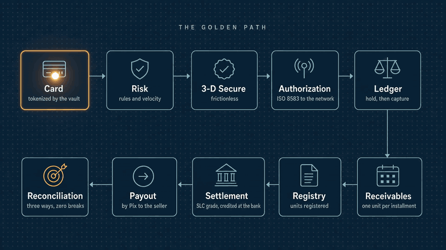
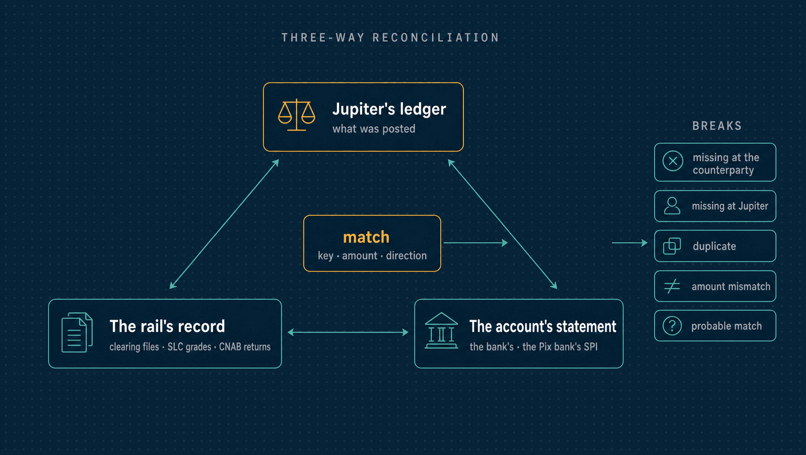

<p align="center">
  
</p>

<p align="center">
  <a href=".github/workflows/ci.yml"></a>
  <a href=".github/workflows/nightly.yml"></a>
  
</p>

# Jupiter

The backend of a payment service provider: the system behind an API like Stripe's or
Pagar.me's. It accepts payments by **card, Pix and boleto**, splits them between
recipients, carries card sales through **receivables, registration and centralized
settlement**, pays merchants out, and handles disputes. A **double-entry ledger** sits
underneath all of it, and every movement is **reconciled three ways**.

<p align="center">
  <b>6</b> simulated counterparties · <b>42</b> architecture decisions · <b>110</b> test files · <b>21</b> alerts, each with a runbook
</p>

Every counterparty is a simulator shipped in this repository and reached over the
protocol a real one would use: the card network over ISO 8583, Pix through the Banco
Central's API Pix over mutual TLS, a bank through CNAB 240 files, the receivables
registry and the SLC through their APIs. Jupiter connects to no real network and is not
a licensed payment institution.

---

## Architecture

<p align="center">
  
</p>

- **A modular monolith with hard boundaries.** Each module's root package is its only
  public interface, and a test fails the build when one module reaches into another.
  The API and the worker are two binaries of the same code.
- **Card numbers never reach Jupiter's API.** The checkout page sends them to the vault,
  a separate process with its own database, reached only over mutual TLS and encrypted
  under keys that rotate. A test plants card numbers and proves none of them lands in
  Jupiter's database ([PCI scope](docs/pci-scope.md)).
- **A timeout is an unknown outcome, not a decline.** Every call to a rail is recorded
  before it is made, and a resolver asks the rail what happened. A request that dies
  between its phases is finished by a completer from its last recovery point.
- **The ledger cannot be unbalanced.** Entries are append-only and zero-sum per
  transaction, enforced by the database at commit. Holds are two-phase transfers, and
  invariants are checked continuously.

The reasoning behind each choice, and what it costs, is in the
[decision records](docs/adr/README.md).

---

## Stack

| | |
|---|---|
| **Language** |  |
| **Data** |    |
| **API** |    |
| **Observability** |     |
| **Quality** |      |
| **Delivery** |   |

---

## What it does

| Area | What a merchant gets |
|---|---|
| **API** | Stripe-style payment intents, prefixed ids, `livemode`, a dated `Jupiter-Version`, cursor pages, typed errors with a request id, `Idempotency-Key` on every write, and HMAC-signed webhooks with retries ([conventions](docs/adr/0011-api-conventions.md)) |
| **Cards** | Authorization, capture, void and refund over ISO 8583, reversals and advices repeated until acknowledged; installments, stored credentials, network tokens, 3-D Secure 2 and daily clearing files |
| **Risk** | Rules a merchant can write, velocity per card and address, card-testing detection with a throttle, and a log that explains every decision ([guide](docs/api/risk.md)) |
| **Pix** | Charges with and without due dates per the Banco Central's specification, BR Codes checked against every example in its manual, refunds as returns, Pix that paid nothing returned, and subscriptions by Pix Automático ([guide](docs/api/pix.md)) |
| **Boleto** | Hybrid boletos with a Pix QR code, sent to the bank in CNAB 240 files by a library of its own, fuzzed and strict both ways ([guide](docs/api/boleto.md)) |
| **Receivables** | One unit per installment, registered with a registry whose Convenção waterfall is property-tested against a reference model, reconciled daily, weekly and fortnightly ([guide](docs/api/receivables.md)) |
| **Marketplaces** | Recipients with verification and balances, splits as typed ledger lines that never lose a centavo, and anticipation priced as present value ([guide](docs/api/recipients.md)) |
| **Settlement and payouts** | Card receivables settled through the SLC in a daily grade; payouts by Pix or bank transfer, scheduled or on demand, with minimums, holds and returns ([guide](docs/api/payouts.md)) |
| **Disputes** | Chargebacks through representment, pre-arbitration and arbitration, and Pix MED claims, in one model moved on by dated deadlines; losses recovered from the liable recipient's future units ([guide](docs/api/disputes.md)) |
| **Reconciliation** | Every movement matched across the ledger, the rail's record and the bank statement, with scored breaks in an aged queue and daily reports ([how it works](docs/reconciliation.md)) |

---

## The golden path

One flow that crosses every part of the system, and stays working:

<p align="center">
  
</p>

A marketplace onboards a seller, and a customer pays R$ 600.00 in six installments,
split between the two. The money then moves through every stage:
- the payment is authenticated and authorized, then captured;
- it clears in the network's file and becomes twelve receivable units at the registry;
- the seller anticipates two of them and is paid out by Pix;
- months later the SLC settles what is due into Jupiter's bank account;
- a chargeback is represented and won;
- every counterparty reconciles with zero breaks.

`make demo` runs it, narrating each step. It runs in CI on every push
([`test/e2e/golden_path_test.go`](test/e2e/golden_path_test.go)).

---

## Correct under failure, measured under load

**Two deterministic simulations** run the whole stack on a virtual clock, every decision
drawn from one seed:
- **cards**: test and live, over ISO 8583;
- **every rail**: Pix with MED, boleto, payouts, receivables settled through the registry
  and the SLC, chargebacks.

They inject:
- requests and answers lost, or answered late or twice;
- statement lines and return files duplicated, delayed or lost;
- simulators whose clocks drift from Jupiter's;
- processes that crash between phases or part-way through background work.

Each run drains until nothing is open. Then every invariant must hold, and reconciliation
must find exactly the breaks the faults made: none missing, none extra. A fixed budget of
seeds runs on every push and random seeds run every night. The same seed replays the same
run, and every seed that ever found a bug stays as a regression
([ADR 0042](docs/adr/0042-simulation-of-every-rail.md)).

<p align="center">
  
</p>

**Load tests** take the authorization path (HTTP, risk, vault, ISO 8583, ledger) and the
ledger to saturation. Every number comes with its command and hardware:

| | Saturates at | p99 there |
|---|---|---|
| Authorizations, end to end | about **2,400 a second**, at one merchant or across eight | 9 ms |
| Ledger postings | about **17,500 a second** | 4 ms |

Profiling found what held one merchant to 1,343 authorizations a second: a lock in the
risk engine, then a hot balance row. Each fix is recorded with its numbers before and
after ([benchmarks](docs/benchmarks/authorization-path.md)).

**In operation**, metrics flow through OpenTelemetry to Prometheus. It evaluates 21
alerts, from an unbalanced ledger to an ageing reconciliation break, and each one links to
its [runbook](docs/runbooks/README.md).

---

## Start here

If you only have ten minutes for the code, these are the pieces worth opening:

| What | Where |
|---|---|
| **A ledger the database keeps balanced.** A constraint trigger refuses, at commit, any transaction whose entries do not sum to zero. | [`00001_ledger.sql`](internal/ledger/migrations/00001_ledger.sql) · [`check.go`](internal/ledger/check.go) |
| **Timeouts resolved, never guessed.** The resolver asks the rail about every operation in flight, retries what never arrived, and reverses what stays unknown. | [`resolver.go`](internal/payments/resolver.go) |
| **Idempotency with recovery points.** A request runs in atomic phases. One that dies is finished from where it stopped, and a retry gets the same answer, byte for byte. | [`idempotency.go`](internal/api/idempotency.go) |
| **ISO 8583 that survives a lost answer.** Every message is recorded before it is sent; reversals and advices are repeated until acknowledged. | [`rail.go`](internal/acquirer/rail.go) |
| **Card data kept out.** A canary test plants card numbers and searches every table for them. | [`canary_test.go`](test/pci/canary_test.go) · [`kms.go`](internal/vault/kms/kms.go) |
| **Brazilian formats, to the byte.** BR Codes and CNAB 240 files, each fuzzed and checked against its specification's own examples. | [`brcode.go`](pkg/brcode/brcode.go) · [`cnab240/`](pkg/cnab240/) |
| **Three-way matching.** Exact matches resolve themselves; everything else becomes a scored break with its reasons. | [`match.go`](internal/reconciliation/match.go) |
| **Faults on every rail, replayable by seed.** Faults drawn by order rather than by identifier, crashes at the k-th statement, and expected breaks. | [`rails_test.go`](test/simulation/rails_test.go) · [`rails_run_test.go`](test/simulation/rails_run_test.go) |

---

## Simulated counterparties

| Simulator | Stands for | Speaks |
|---|---|---|
| [`sim-card-network`](internal/sim/cardnetwork/README.md) | A card network and its issuer, with clearing files and a dispute system | ISO 8583 over TCP, HTTP for files and disputes |
| [`sim-3ds`](internal/sim/3ds/README.md) | A 3-D Secure 2 directory server and access control server | EMV 3DS messages |
| [`sim-pix`](internal/sim/pix/README.md) | Jupiter's Pix bank: SPI settlement, the DICT key directory, MED | The Banco Central's API Pix, over mutual TLS |
| [`sim-bank`](internal/sim/bank/README.md) | A bank holding Jupiter's account, collecting boletos and making transfers | CNAB 240 files and a statement API |
| [`sim-registry`](internal/sim/registry/README.md) | A card receivables registry | The registries' common API |
| [`sim-slc`](internal/sim/slc/README.md) | The centralized settlement for sub-acquirers | Grades and settlement windows |

Each one can lose, delay or repeat what it sends. Where its behaviour rests on a claim the
research could not verify against a primary source, its documentation says so.

---

## Quick start

Requires **Go 1.27** and Docker with Compose. Every other tool is pinned in
[`tools/go.mod`](tools/go.mod) and runs through `go tool`.

```bash
git clone https://github.com/iricardofernandes/jupiter.git && cd jupiter

make check             # format, vet, lint, vulnerabilities, unit and architecture tests
make demo              # the golden path, narrated step by step
make test-integration  # every rail against a real PostgreSQL in Docker
make test-simulation   # both simulations (SIM_SEEDS, SIM_SEED, SIM_PAYMENTS, SIM_RAIL_SCENARIOS)
make help              # every target
```

To run the binaries against local infrastructure:

```bash
make up                # PostgreSQL ×2, the OpenTelemetry Collector, Jaeger, Prometheus, Grafana
make migrate           # Jupiter's and the vault's migrations
make certs             # a development CA and the mTLS certificates
make merchant NAME=x   # a merchant, and its API keys, shown once
```

Then start the vault (`go run ./cmd/vault`), the simulators the rails you want need
(`go run ./cmd/sim-<name>`), and the API and worker (`go run ./cmd/api`,
`go run ./cmd/worker`). [`.env.example`](.env.example) lists what each reads. A first
payment:

```bash
curl -X POST http://127.0.0.1:8080/v1/payment_intents \
  -H "Authorization: Bearer $SK_TEST" -H "Idempotency-Key: $(uuidgen)" \
  -d '{"amount": 60000, "currency": "brl", "payment_method": "pm_card_visa", "confirm": true}'
```

The local services listen on 127.0.0.1 only, on ports of their own: PostgreSQL on 55432,
Prometheus on 59090, Grafana on 53000, Jaeger on 56686. [Testing payments](docs/api/testing.md)
lists the test cards and amounts.

---

## Decisions

Every significant choice is recorded in [`docs/adr/`](docs/adr/README.md): 42 decisions,
each with the alternatives it rejected. Five of them shape everything else:

- **A modular monolith, with the vault apart.** One deployable for the domain, a separate
  process for card data ([0001](docs/adr/0001-modular-monolith-with-isolated-vault.md)).
- **Money as integer minor units.** No floats anywhere near an amount
  ([0003](docs/adr/0003-money-as-integer-minor-units.md)).
- **Immutable two-phase transfers.** Holds and captures are postings, never updates
  ([0009](docs/adr/0009-immutable-two-phase-transfers.md)).
- **Unknown is a state.** A payment whose outcome is unknown is resolved, never guessed
  ([0014](docs/adr/0014-payment-intents-attempts-and-unknown-outcomes.md)).
- **Regulation as dated configuration.** Deadlines, fees and rules are tables with
  effective dates, not code ([0006](docs/adr/0006-regulatory-rules-as-dated-configuration.md)).

---

## Documentation

| | |
|---|---|
| [`api/openapi.yaml`](api/openapi.yaml) | The API contract; the server is generated from it |
| [`docs/api/`](docs/api/) | Guides: errors, webhooks, testing, risk, Pix, boleto, payouts, subscriptions, receivables, recipients, disputes, reconciliation |
| [`docs/adr/`](docs/adr/) | 42 decision records |
| [`docs/reconciliation.md`](docs/reconciliation.md) | The three-way reconciliation algorithm |
| [`docs/benchmarks/`](docs/benchmarks/) | Load tests and profiling, with commands and hardware |
| [`docs/runbooks/`](docs/runbooks/) | What to do about each alert |
| [`docs/pci-scope.md`](docs/pci-scope.md) | What handles card data, what does not, and the tests that keep it so |
| [`docs/cardnet/`](docs/cardnet/) | The card network's ISO 8583 specification, field by field |
| [`api/bacen-pix/`](api/bacen-pix/) | The Banco Central's API Pix specification, pinned |
| [`docs/research/`](docs/research/) | How the payments market works, globally and in Brazil |
| [`docs/plan.md`](docs/plan.md) | How the project was built, step by step, with exit criteria and non-goals |

---

## About

Built by **Ricardo Fernandes de Oliveira** ·
[LinkedIn](https://www.linkedin.com/in/ricardof-oliveira/)

I built Jupiter because payments are where software meets money that cannot be lost. A
timeout is not a decline, a retry must not charge twice, and a cent that goes missing
shows up in someone's books. Brazil makes the problem richer than most: Pix, boleto,
credit card sales in installments that become registered receivables, and a centralized
settlement that global PSPs never had to model.

Every claim here has evidence behind it: a test, a simulation that replays by seed, a
measurement with its command, or a decision record that names what was traded away.
When something is simulated rather than real, the documentation says so.
