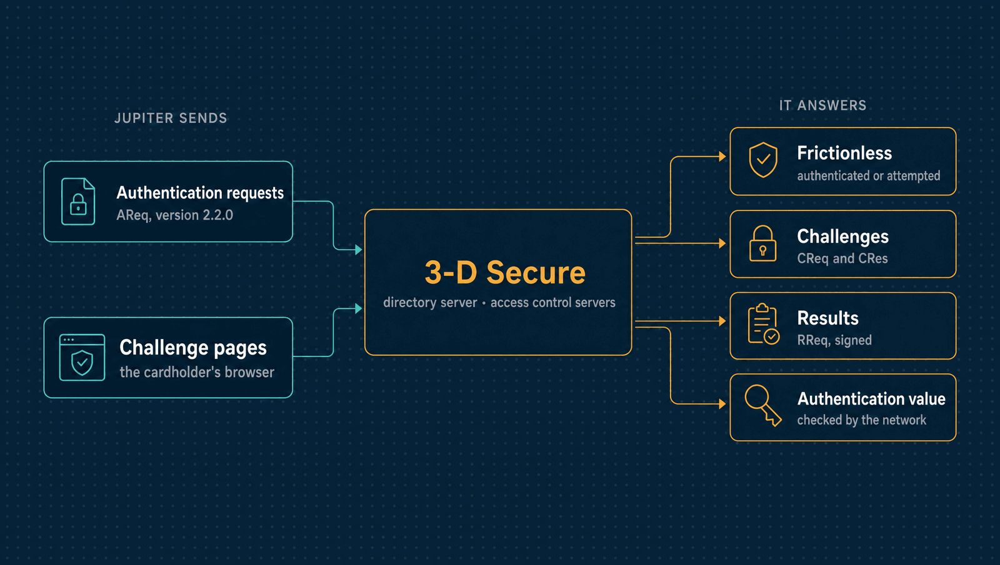

# 3-D Secure directory server and access control server simulator

`sim-3ds` stands for a card scheme's 3-D Secure directory server (DS) and the issuers'
access control servers (ACS) behind it. Jupiter's 3DS server reaches it over HTTP with the
JSON messages of [`pkg/threeds`](../../../pkg/threeds); a cardholder's browser reaches the
challenge pages. It is not EMVCo-certified. The EMVCo specification was not read, so most
of the protocol below is unverified, as marked.

| | |
|---|---|
| **Binary** | `sim-3ds` (`go run ./cmd/sim-3ds`) |
| **Listens on** | `127.0.0.1:8585` |
| **Speaks** | EMV 3-D Secure 2.2.0 messages, as JSON over HTTP |
| **Jupiter's side** | [`internal/authentication`](../../authentication/) |

<p align="center">
  
</p>

---

## Run it

```sh
JUPITER_SIM_AUTHENTICATION_KEY=$(openssl rand -base64 32) JUPITER_3DS_RESULTS_SECRET=... \
  go run ./cmd/sim-3ds    # HTTP on 127.0.0.1:8585
```

---

## Protocol

| Element | What the simulator does | Source |
|---|---|---|
| Version | 2.2.0 only | Sourced: 2.1.0 was retired in September 2024; 2.2.0 is the baseline and 2.3.1 the latest (research: card rails, 3DS2) |
| Actors and messages | AReq/ARes between 3DS server and DS (the DS answers for the ACS), CReq/CRes through the browser, RReq/RRes from the ACS through the DS to the 3DS server | Unverified: the EMVCo architecture as commonly described |
| transStatus | Y authenticated, A attempted, C challenge, N not authenticated, R rejected, U unavailable | Unverified |
| ECI | Visa and others: 05 authenticated, 06 attempted; Mastercard (5, 2): 02 and 01 | Unverified |
| Authentication value | base64 of 20 bytes: HMAC-SHA256 of card, amount and dsTransID, under a key shared with sim-card-network, which checks it | The simulator's; real CAVV/AAV algorithms are the schemes' |
| AReq fields | messageType, messageVersion, messageCategory, deviceChannel, threeDSServerTransID, threeDSServerURL, requestor, acquirer and merchant data, acctNumber, cardExpiryDate, purchaseAmount/Currency/Exponent/Date, transType, notificationURL, browserIP | Field names unverified; the simulator requires only transaction ids, URLs, card and a BRL amount |
| Errors | A message it cannot process is answered with an Erro message (errorCode 203) | Unverified |
| CReq and CRes | base64url JSON in the creq and cres form fields; threeDSSessionData passed through | Unverified |
| RReq authentication | signed with HMAC-SHA256 in `Threeds-Signature` | The simulator's; real directory servers use mutual TLS |
| 3DS Method, app channel, decoupled authentication | Not simulated | |

---

## Test cards

Any other card is authenticated frictionless.

| Number | ACS answer |
|---|---|
| 4000000000003220 | Challenge: the code 123456 authenticates, anything else fails (N) |
| 4000000000003238 | Not authenticated (N) |
| 4000000000003246 | Rejected (R) |
| 4000000000003253 | Unavailable (U): the payment goes on without authentication |
| 4000000000003261 | Attempted (A), ECI 06 |
