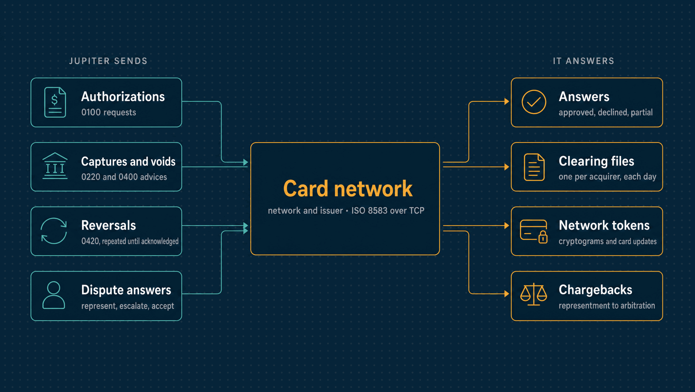

# Card network and issuer simulator

`sim-card-network` stands for a card network and the issuers behind it. Jupiter's
acquirer connector reaches it the way it would reach a real one: ISO 8583 over TCP, as
[docs/cardnet/iso8583.md](../../../docs/cardnet/iso8583.md) specifies, and clearing files
over HTTP. Nothing in it is certified, and no scheme's proprietary behaviour is modelled.

| | |
|---|---|
| **Binary** | `sim-card-network` (`go run ./cmd/sim-card-network`) |
| **Listens on** | `127.0.0.1:8583` (ISO 8583) · `127.0.0.1:8584` (HTTP) |
| **Speaks** | ISO 8583 over TCP; clearing files and disputes over HTTP |
| **Jupiter's side** | [`internal/acquirer`](../../acquirer/), and [`internal/disputes`](../../disputes/) for chargebacks |

<p align="center">
  
</p>

---

## Run it

```sh
go run ./cmd/sim-card-network   # ISO 8583 on 127.0.0.1:8583 (JUPITER_CARDNET_ADDR), files on 127.0.0.1:8584 (JUPITER_HTTP_ADDR)
curl -X POST -H 'Content-Type: application/json' 'http://127.0.0.1:8584/admin/close-day?date=2026-10-01'
curl http://127.0.0.1:8584/v1/acquirers/10000000001/clearing/2026-10-01
```

The operator's controls (`/admin/`) answer only when addressed to this machine, and a POST
only as JSON, so a web page cannot drive them.

---

## What it does

| Behaviour | Source |
|---|---|
| Answers every request (0100, 0200, 0400) and advice (0220/0221, 0420/0421) with its response type | Sourced: the ISO 8583:1987 message classes |
| Holds an authorization's amount against the card's credit, releases it on reversal, and turns it into a completion for up to its amount, releasing the rest | Sourced in principle (dual-message authorization and capture); the amounts are the simulator's |
| Acknowledges a reversal of something it never saw, or already reversed | Sourced: an acquirer reverses what it cannot be sure did not happen, and the issuer must process it |
| Refuses a merchant-initiated authorization that does not quote an earlier network transaction id of the same card (57) | Unverified: the stored credential framework as the research described it |
| Stands in for an unavailable issuer, approving up to R$ 500.00 and flagging it (DE 48 SI) | Unverified: stand-in processing as commonly described; the limit is the simulator's |
| Approves half the amount (10) only when the request says it can take a partial approval | Unverified: the partial approval code and capability flag |
| Closes each business day at midnight, or when told, into one clearing file per acquirer | The file format is the simulator's; real clearing is proprietary |

Each card has a credit limit of R$ 100,000.00. Expired cards (DE 14 in the past) are
declined with 54, numbers failing the Luhn check with 14.

---

## Test cards

Any other valid number is approved while its limit lasts.

| Number | Behaviour |
|---|---|
| 4000000000000002 | Declined: do not honour (05) |
| 4000000000009995 | Declined: insufficient funds (51) |
| 4000000000000069 | Declined: expired card (54) |
| 4000000000000119 | Approved and held, but the answer is lost: the acquirer must reverse it |
| 4000000000000168 | The request is lost before the issuer: nothing is held |
| 4000000000000127 | Approved, answered after the acquirer's timeout |
| 4000000000000135 | Approved, answered twice |
| 4000000000000143 | Half approved (10) when partial approval is offered, fully approved otherwise |
| 4000000000000150 | The issuer is down: approved in stand-in up to R$ 500.00, 91 above |

---

## 3-D Secure and network tokens

With `AuthenticationKey` set (JUPITER_SIM_AUTHENTICATION_KEY, shared with sim-3ds), an
authorization carrying a 3-D Secure authentication value in DE 48 AV is declined (05) if
the value does not check out for its card, amount and directory server transaction.

The network also runs a token service ([docs/cardnet](../../../docs/cardnet/iso8583.md#network-tokens)):
it provisions tokens, issues cryptograms, checks them on authorizations, and tells the
token requestor (JUPITER_CARDNET_EVENTS_URL, signed with JUPITER_CARDNET_EVENTS_SECRET)
when `POST /admin/cards/replace {pan, new_pan, exp_month, exp_year}` replaces a card or
`POST /admin/tokens/{reference}/suspend` suspends a token. All of it is unverified
against real token services.

---

## Disputes

Chargebacks and fraud reports travel over HTTP, outside ISO 8583, as the networks'
dispute systems do (Visa's VROL, Mastercard's Mastercom). Their messages are the
simulator's ([pkg/cardnet/disputes.go](../../../pkg/cardnet/disputes.go)).

| Behaviour | Source |
|---|---|
| An issuer opens a chargeback on a completion, for what is left of it: `POST /admin/disputes {network_transaction_id, amount, reason_code, issuer, arbitration}` | The flow (chargeback, representment, pre-arbitration, arbitration) is as the research described Mastercard's |
| A fraud chargeback (Visa 10.x, Mastercard 4837…) of an authorization 3-D Secure authenticated is refused: the liability shifted to the issuer | Sourced in principle: 3-D Secure's liability shift |
| The acquirer represents within 45 days (Mastercard, cards starting 5 or 2) or 30 (the others), and answers a pre-arbitration within 30: past that, the case is the issuer's | Mastercard's: Chargebacks911. The others': secondhand, unverified |
| The issuer, as scripted (`issuer`), accepts a representment, rejects it into pre-arbitration, or stays silent: past 30 days, the acquirer wins. Arbitration rules after 30 days, for whom `arbitration` says | The 30 days: Mastercard's, as above. The scripts are the simulator's |
| A representment citing the participants' liability cap wins when the dispute came more than 180 days after the authorization | Res. BCB 522/2025, from the draft the research read |
| An issuer reports fraud apart from any dispute: `POST /admin/fraud-reports {network_transaction_id, fraud_type}` | Visa's TC40 and Mastercard's SAFE, as described |

Every change is posted to the acquirer (`JUPITER_CARDNET_DISPUTE_EVENTS_URL`), signed as
token events are but with a secret of its own (`JUPITER_CARDNET_DISPUTE_EVENTS_SECRET`):
`dispute.updated` and `fraud_report.created`. The acquirer answers and reads, with its
bearer token (`JUPITER_CARDNET_TOKEN`), at:
- `GET /v1/acquirers/{acquirer}/disputes/{id}`, a case as it stands;
- `GET /v1/acquirers/{acquirer}/disputes?since=`, the cases changed since, for events
  that never arrived;
- `POST /v1/acquirers/{acquirer}/disputes/{id}/actions`, to represent, escalate or
  accept;
- `GET /v1/acquirers/{acquirer}/fraud-reports/{id}`, a fraud report.

---

## Faults

`Config.ClearingFaults` is asked about every record before it goes into a clearing file,
and can lose it, list it twice, or hold it for the next day's file.

In-process, `Config.Faults` is asked about every request and advice and can lose the
request, lose the answer, answer late (after `Config.LateAfter`) or answer twice. The
deterministic simulation uses it to draw faults from its seed.
