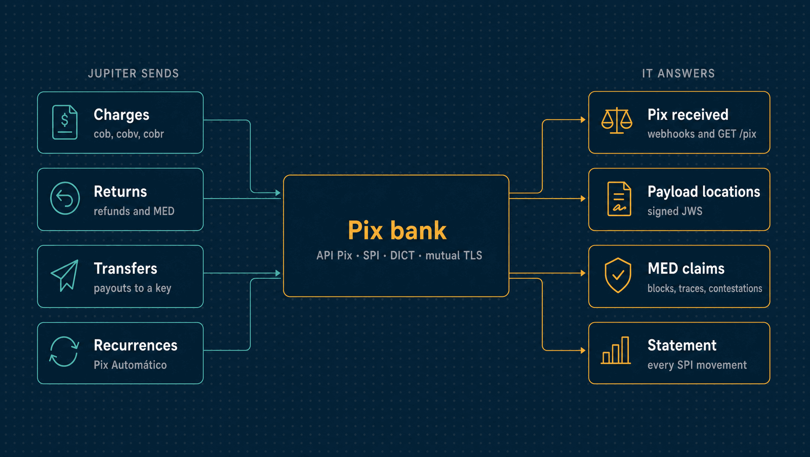

# Pix simulator

`sim-pix` stands for the Pix side of the world: the partner bank that holds Jupiter's
account and offers it the Banco Central's **API Pix**, the SPI that settles between
participants, DICT, which resolves keys, and every payer and their bank. Jupiter reaches it
the way it would reach a real bank: HTTPS with mutual TLS and certificate-bound OAuth
tokens. It notifies Jupiter the same way. Nothing in it is certified. It is not a Pix
participant, and it connects to no real SPI or DICT.

The request and response types are generated from the official specification
(`pkg/pixapi`, from `api/bacen-pix`, version 2.10.0). The BR Codes are
[`pkg/brcode`](../../../pkg/brcode)'s.

| | |
|---|---|
| **Binary** | `sim-pix` (`go run ./cmd/sim-pix`) |
| **Listens on** | `https://127.0.0.1:8586` (API Pix) · `127.0.0.1:8587` (operator) |
| **Speaks** | The Banco Central's API Pix 2.10.0, over mutual TLS with certificate-bound tokens |
| **Jupiter's side** | [`internal/pix`](../../pix/) |

<p align="center">
  
</p>

---

## Run it

```sh
make certs
JUPITER_SIM_TLS_CERT=.certs/sim-pix.pem JUPITER_SIM_TLS_KEY=.certs/sim-pix-key.pem JUPITER_SIM_TLS_CA=.certs/ca.pem \
JUPITER_SIM_WEBHOOK_CERT=.certs/sim-pix-hook.pem JUPITER_SIM_WEBHOOK_KEY=.certs/sim-pix-hook-key.pem \
JUPITER_SIM_PIX_CLIENTS=jupiter-live:secret:7f6e5d4c-3b2a-4190-8f7e-6d5c4b3a2918:1000000 \
  go run ./cmd/sim-pix    # API Pix on https://127.0.0.1:8586, operator controls on http://127.0.0.1:8587

# a customer pays the BR Code Jupiter showed them
curl -X POST http://127.0.0.1:8587/admin/pay -d '{"brcode": "00020101021226...", "payer_tax_id": "12345678909"}'
```

---

## What it does

| Behaviour | Source |
|---|---|
| OAuth 2.0 client credentials at `POST /oauth/token`, over mutual TLS. The token is bound to the client certificate's SHA-256 thumbprint (`x5t#S256`); a token presented on a connection made with any other certificate is refused (401) | Sourced: Manual de Padrões, Anexo II §3.1 (RFC 8705 certificate-bound tokens) |
| Scopes `cob.*`, `cobv.*`, `pix.*`, `webhook.*`, checked per route | Sourced: the specification's security schemes |
| Immediate charges (`PUT/POST/GET/PATCH /cob`) and charges with a due date (`PUT/GET/PATCH /cobv`). A txid is 26 to 35 letters and digits and is never reused, even after its charge is removed | Sourced: specification and manual Anexo I §5.3.1 |
| Charge statuses `ATIVA`, `CONCLUIDA` and `REMOVIDA_PELO_USUARIO_RECEBEDOR`. Expiry is never a status: a cob expires `expiracao` seconds after creation, and a cobv at the end of `validadeAposVencimento` days after its due date | Sourced: the status enum and calendar fields |
| Each charge gets a payload location, and `pixCopiaECola` carries a dynamic BR Code pointing to it | Sourced: manual §2.5.2, §2.7 |
| A payload location answers with the charge's payload as a compact JWS, content type `application/jose`, and 410 for a charge that is paid, removed or expired | Sourced: manual §2.7.2 (RFC 7515) and §2.7.3 |
| The JWS is signed PS256, with a `jku` header naming the key set at `/jwks` on the same host, which payers check before paying | **Unverified**: the algorithm and headers are set by the Manual de Segurança do SFN, which the research could not obtain |
| cobv amounts on a date: the original, less a fixed or percentage rebate (abatimento), less a discount (modalities 1 and 2 until fixed dates, 3 and 5 per day early), plus a fine (fixed or percentage) and interest (modalities 1 to 4: an amount per day, or a percentage per day, month or year of calendar days) when paid late. A payer asks with `DPP` | Modalities sourced from the specification's domain tables. The arithmetic is **unverified**: percentages are of the original amount, rounded half up to the centavo, a month counts 30 days and a year 365. The business-day modalities (juros 5-8, desconto 4 and 6) are refused: the simulator has no calendar |
| A Pix received: an endToEndId `E` + ISPB + minute in UTC + 11 characters | Sourced: the format as the research describes it |
| `GET /pix` (by period, paged) and `GET /pix/{e2eid}`, with the Pix's returns and, for a cobv, `componentesValor` | Sourced: specification |
| Returns (`PUT/GET /pix/{e2eid}/devolucao/{id}`), partial or whole, never more than the Pix. They start `EM_PROCESSAMENTO` and end `DEVOLVIDO`, or `NAO_REALIZADO` when the payer's account is closed or the client's balance is short | Statuses sourced. The reasons for failure are the simulator's |
| Notifications: `PUT /webhook/{chave}` registers an https URL. Each Pix with a txid received on that key, and each return that reaches a final status, is posted to `{url}/pix` over mutual TLS with the bank's certificate. A Pix without a txid is not notified | Sourced: specification. The body is `{"pix": [...]}`, with the fields of `GET /pix/{e2eid}` |
| Transfers out: `PUT /transferencias/{idEnvio}` with `valor` and `chave`, and `GET /transferencias/{idEnvio}`. The key is resolved in DICT and the transfer settled at once, `REALIZADO`, or refused, `NAO_REALIZADO`: unknown key, closed account, short balance | **The simulator's own**: the API Pix does not cover sending, and each bank has its own interface. This one follows the API's conventions: client-chosen ids, an idempotent PUT, and the same error format |
| Errors as RFC 7807 problems typed `https://pix.bcb.gov.br/api/v2/error/<Type>` (`CobOperacaoInvalida`, `PixDevolucaoInvalida`, `AcessoNegado`, …) | Sourced: specification |

Not simulated: lotecobv, Pix Saque and Pix Troco (refused), key portability,
participants other than the bank itself as receivers, and time spent in the SPI.

---

## Pix Automático

The receiver's side, as the Manual de Padrões' Anexo IV and the specification describe it,
and the payer and their bank as the rest of the world.

| Behaviour | Source |
|---|---|
| Recurrences (`POST /rec`, `GET /rec/{idRec}`, `GET /rec` by period and payer, `PATCH` to cancel, or to give a location before approval). The idRec is `R`, `R` or `N` (retries allowed or not), the ISPB, the day and 11 characters. Statuses `CRIADA`, `APROVADA`, `REJEITADA`, `EXPIRADA` (after `dataFinal`), `CANCELADA`, with their history | Sourced: Anexo IV §2.1, §3.1, §4.1 |
| Journey 1: `POST /solicrec` sends the request to the payer's bank (`CRIADA` → `ENVIADA` → `RECEBIDA`). The payer accepts, approving the recurrence, or rejects it. A request to an ISPB with no bank behind it is rejected (`DADOS_BANCARIOS_INVALIDOS`). Requests expire at `dataExpiracaoSolicitacao` | Sourced: §2.2, §3.2. The payer's decision is the simulator's control |
| Journey 2: `POST /locrec`, and a recurrence with that location, whose `dadosQR.pixCopiaECola` is a composite BR Code with only the recurrence URL. The payer's bank fetches its signed payload (as for dynamic codes), checks the payer is the debtor, and approves it | Sourced: manual §2.8, Anexo IV §4.4. The signature is as unverified as the payment payloads' |
| Journeys 3 and 4, and recurrences from Open Finance (`C…`) | Not simulated; journey 3 data is refused |
| Recurring charges (`PUT/POST /cobr`, `GET`, `PATCH` to cancel): only under an approved recurrence, to the client's own account, at the recurrence's fixed amount, within its validity, one per cycle. Cycles repeat from the first date by the period, a day the month lacks becoming its last | Sourced: §2.3, §4.3.1 |
| A charge must be made at least 2 days before its due date and is sent to the payer's bank from 10 days before | **From the BCB's Pix Automático FAQ as the research summarized it**, not a primary text the research read |
| `ajusteDiaUtil` moves a due date on a weekend to Monday | Sourced in principle (§2.3.9). The simulator knows no holidays, national or local |
| Sent to the payer's bank, the first attempt (`AGND`) goes `SOLICITADA` → `AGENDADA` and the charge `ATIVA`. On its date the payer's bank debits it if the payer has the money, trying again through the day. The attempt is `PAGA` and the charge `CONCLUIDA`, with the Pix listed and in `GET /pix`. Otherwise the attempt is `EXPIRADA` the next day | Sourced: §3.3.1-3.3.4 |
| Retries (`POST /cobr/{txid}/retentativa/{data}`, type `NTAG`, each with its own endToEndId), only under `PERMITE_3R_7D`: up to three, on different days, within seven days of the first, asked for before the day. Without retries, or with them used up or out of time, the charge is `EXPIRADA` | Sourced: §2.1.5, §4.1.4 |
| The receiver cancels a charge until the day before its first debit. Canceling a recurrence cancels its pending requests and the charges not yet due. The payer can revoke a recurrence in their bank's app | Sourced: §3.3.6, §4.1.3, §4.3.2 |
| The payer's bank rejects a charge to a closed account (`AC05`) or of the wrong amount (`AM09`), rejecting the charge | The codes and their effect on the charge are the specification's (§3.3.5). Which one applies to which case is the simulator's choice, from the ISO 20022 meanings |
| Rejection and cancellation codes: a payer refusing a request is `AP13`; a receiver canceling is `SLCR`, a payer `SLDB` (recurrence) or `SLBD` (charge) | **The simulator's choices** among the specification's codes; their meanings are in the SPI message catalogue, which the research could not read |
| Intraday retries after a settlement error (`RIFL`), Pix Automático returns (`MED_PIX_AUTOMATICO`) | Not simulated |
| Notifications: `PUT /webhookrec` and `/webhookcobr` register URLs; every change to a recurrence is posted to `{url}/rec` (`{"recs": [...]}`) and to a charge to `{url}/cobr` (`{"cobsr": [...]}`), over mutual TLS | Sourced: specification |

`Tick` moves the days: requests and recurrences expire, charges enter the window, debits
happen and attempts expire. The binary ticks every ten seconds. Tests call it after moving
their clock, which is how a year runs in seconds.

---

## MED

MED claims reach the receiving bank's clients through the bank; the API Pix does not
cover them. The relay is **the simulator's format** (`pkg/pixapi/med.go`), after the
DICT's names, since neither the DICT's interface nor a bank's could be read.

| Behaviour | Source |
|---|---|
| A payer contests a Pix as fraud (`POST /admin/infraction-reports` `{"endToEndId", "amount", "details", "upheld"}`), within 80 days of it and for no more than is left of it | The 80 days: MED as reported in September 2026 (meutudo), not a primary text |
| The bank blocks what of the claim the client's account holds, for up to 11 days; neither transfers nor returns can spend it. A claim no one answers loses its block when the 11 days end | MED 2.0 as Agência Brasil reported it (Feb 2026); the regulation was not read |
| The report reaches the client's webhook at once, `{url}/infracoes` (`{"infractionReports": [...]}`), over mutual TLS | The 30-minute notification window is MED 2.0's, as reported; the path is the simulator's |
| `GET /infracoes/{id}`, `GET /infracoes?inicio&fim` (scope `infracao.read`) | The simulator's |
| `POST /infracoes/{id}/analise` (scope `infracao.write`): `AGREED` with `refundId` and `valor` returns that much to the payer as a devolução of nature `MED_FRAUDE`, listed under the Pix; `DISAGREED` ends the block. Either closes the report, with the client's `fundsTrace` | The nature is the API Pix's; the rest the simulator's |
| `POST /infracoes/{id}/contestacao`: the client contests a MED return within 80 days of it; the payer's bank decides at once, as `upheld` scripted, crediting the amount back when it upholds it | IN BCB 766/2026's 80 days, as reported (meutudo, Sep 2026). How the payer's bank decides is the simulator's |

---

## Statement

`GET /extrato?data=YYYY-MM-DD` (scope `pix.read`) lists every movement the SPI settled in
the client's account that day, in Brasília, a line each with an id of its own: Pix
received and sent, returns, MED returns and what contestations gave back. Its `referencia`
is what the client knows the movement by: a Pix received's endToEndId, a transfer's
idEnvio, a return's id. The API Pix has no statement; the format is the simulator's
(`pkg/pixapi/statement.go`). A fault on an event of kind `statement` loses a line, writes
it twice, or puts it on the next day.

---

## Payers and operators

The admin handler takes no credentials and must listen on loopback only.

| Route | What |
|---|---|
| `POST /admin/pay` | A payer pays: `{"brcode": "..."}` for a code (a dynamic one is fetched over HTTPS, its signature checked, and paid today), or `{"key": "...", "amount": "10.00"}` for a transfer to a key. Answers the endToEndId, or 422 with why it was refused |
| `POST /admin/dict/keys` | Registers a key: `{"key", "ispb", "name", "tax_id", "closed"}` |
| `POST /admin/payers/{tax_id}/close` | Closes a payer's account: returns to it fail |
| `GET /admin/transfers` | What clients sent |
| `GET /admin/deliveries` | Notifications sent, dropped or refused |
| `GET /admin/balances/{client}` | A client's balance |
| `POST /admin/recurrence-requests/{id}/decide` | The payer accepts (`{"accept": true}`) or rejects a recurrence request |
| `POST /admin/recurrences/{idRec}/cancel` | The payer revokes a recurrence |
| `POST /admin/payers/{tax_id}/funds` | Limits what a payer has for recurring debits (`{"balance": "10.00"}`); `{}` lifts the limit |
| `POST /admin/tick` | Lets the bank's day move now |
| `POST /admin/infraction-reports` | A payer contests a Pix: a MED claim against the client that received it |

---

## Faults

`Config.Faults` is asked before each notification (MED claims' among them), transfer,
return and charge answer. It
can drop a notification, hold a transfer or return in processing for a while, or carry out
a transfer or create a charge and drop the connection before answering. The tests use these to exercise Jupiter's
unknown-outcome paths.
