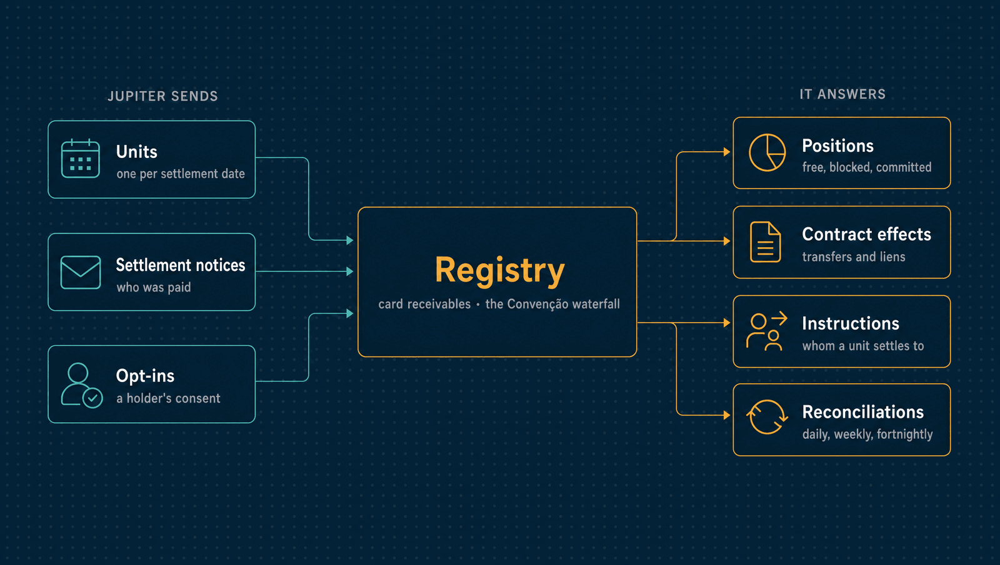

# Receivables registry simulator

`sim-registry` stands for a receivables registry (registradora) for card receivables.
Accreditors such as Jupiter register their merchants' units with it. Financiers place
contract effects on those units. When a unit settles, the registry says who is paid.
Jupiter reaches it over HTTP, as it would a real one.

The registries' layouts were not available to the research. The wire format here
([`pkg/registryapi`](../../../pkg/registryapi/registryapi.go)) is the simulator's own,
with the fields of the Convenção entre Entidades Registradoras' minimum payload. Nothing
in it is certified or connected to CERC, Núclea, B3 or TAG.

| | |
|---|---|
| **Binary** | `sim-registry` (`go run ./cmd/sim-registry`) |
| **Listens on** | `127.0.0.1:8588` |
| **Speaks** | HTTP, in the simulator's format, with the Convenção's minimum payload |
| **Jupiter's side** | [`internal/registry`](../../registry/) and [`internal/receivables`](../../receivables/) |

<p align="center">
  
</p>

---

## Run it

```sh
JUPITER_SIM_REGISTRY_PARTICIPANTS='<token>:11222333000181:accreditor,<token>:33000167000101:financier' \
  go run ./cmd/sim-registry   # 127.0.0.1:8588 (JUPITER_HTTP_ADDR)
```

---

## What it does

| Behaviour | Source |
|---|---|
| A unit is keyed by accreditor, merchant (holder), arrangement and settlement date. Its value is constituted and net | Sourced: Res. BCB 264 art. 2º and art. 3º §3º |
| Units are registered and updated whole, value and block absolute; a lower value is a reduction | The simulator's format |
| An update arriving after the business day following its sale (`constituted_on`) is listed as late | Sourced: Res. BCB 264 art. 3º §1º |
| Effects are ownership transfer or lien, by a fixed amount across the units a contract reaches or a percentage of each. A contract reaches the holder's units, optionally only some arrangements, accreditors or dates | Sourced in principle: Res. BCB 264 art. 4º-5º, Convenção. How a fixed amount spreads across units (earliest settlement date first) is the simulator's choice |
| Contracts take a unit's free amount in the order they were accepted, and extend to units registered later | Sourced: Convenção 3.13, Res. BCB 264 art. 15 §3º-§4º |
| A reduction takes the free amount, then the latest contract's, then the block. A fixed contract that loses amounts takes them back from other free amounts | Free first and LIFO are sourced (Convenção 3.14). That the block goes last, and the retaking, are the simulator's |
| A block takes only the free amount; an update whose block asks for more is refused whole | Sourced: Res. BCB 264 art. 8º |
| A percentage contract keeps what it holds when a unit is reduced, if a later contract's covers the reduction | Follows from LIFO reductions; the simulator's reading |
| Settlement pays contracts in the order accepted, then the holder; the block stays with the accreditor. A unit settles once, and the same notice again answers the same split | Sourced: Convenção 3.13. Repeated notices are the simulator's |
| A settlement notice after the business day following the settlement is listed as late, as is an update after the business day following the change it carries | Sourced: Convenção 5.3.6, Res. BCB 264 art. 3º §1º |
| A financier sees a holder's agenda only after the holder's opt-in, which an accreditor of the holder's units passes on | Sourced: Res. BCB 264 art. 15 |
| Contracts need no opt-in; their ids are each financier's own, and the same contract placed again is accepted again | The simulator's: a contract is signed with the merchant outside the registry |
| Accreditors read their units, settled or not, and the holders with something committed on an unsettled unit: the daily, weekly and fortnightly reconciliations | Sourced: Res. BCB 264 art. 11 |
| Lien and ownership transfer behave alike in settlement | The simulator's; real registries differ for judicial liens (Convenção 5.9.16) |
| Not simulated: portability between registries, contestations, judicial constrictions, prepaid arrangements, interoperability between registries, tariffs | |

Participants authenticate with bearer tokens; real registries use the RSFN and ICP-Brasil
certificates. The arrangement codes for credit (VCC, MCC, ECC, ACC, HCC) are as commonly
published; the research saw only VCP and MCP in a primary text.

---

## API

| Route | Who | |
|---|---|---|
| `PUT /v1/units` | accreditor | Registers or updates units; each is taken or refused on its own |
| `GET /v1/units?holder=&from=&to=&settled=` | both | Positions: value, block, what each contract holds, what is free, and how a settled unit was paid |
| `GET /v1/instructions?holder=&arrangement=&settlement_date=` | accreditor | Whom a unit settles to now |
| `POST /v1/settlements` | accreditor | A settlement notice; answers the split |
| `POST /v1/opt-ins`, `POST /v1/opt-ins/revoke` | accreditor | A holder's authorization for a financier |
| `GET /v1/holders` | accreditor | Holders of its units with a live contract |
| `GET /v1/compliance` | accreditor | Deadlines it missed |
| `POST /v1/contracts`, `POST /v1/contracts/{id}/end` | financier | Places or ends a contract |

---

## Tests

The waterfall is checked two ways. A hand-worked example follows the Convenção's rules
step by step, independently of the code. A property test (`engine_test.go`) checks the
engine against a reference model written separately: the same rules, over plain slices. For any sequence of the steps below, every beneficiary is paid what
the reference pays, no amount goes negative, and no unit is paid twice:
- units constituted and reduced;
- contracts accepted and ended;
- blocks;
- settlements, in full or short.
